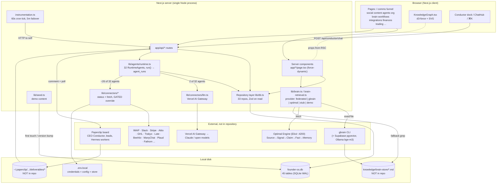
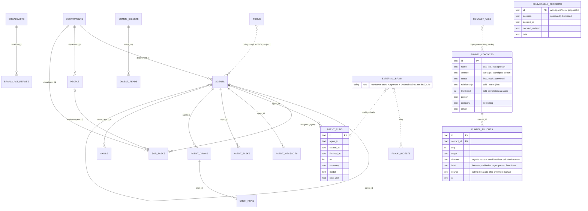
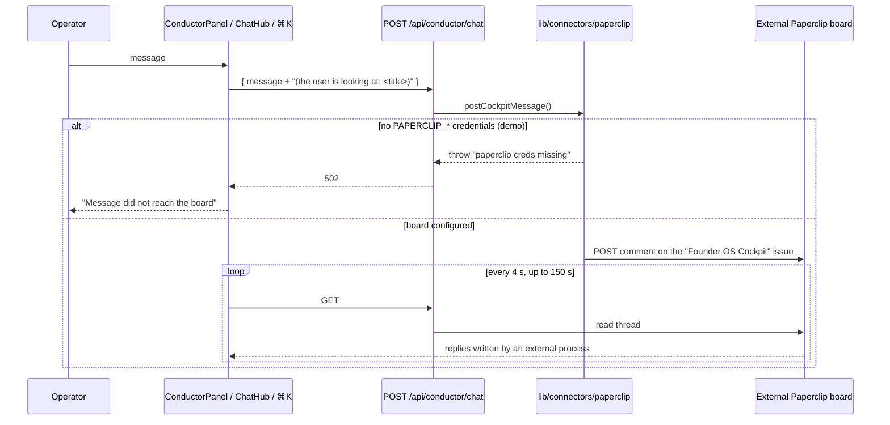
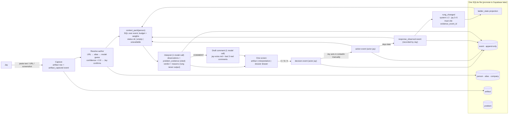

# FounderOS deep dive: a forensic product and technical study for Quiet Bands

**Status:** research only. No QB code was touched. No FounderOS code was installed into QB.
**Date:** 2026-10-04, palette and glow rules revised 2026-10-05
**Subject:** The Founder OS (thefounderos.com) and its public demo repository `Bennettxai/FounderOS-DEMO`, commit `ef75fe8` (2026-09-30), MIT licensed.
**Companion file:** `docs/research/founderos-file-map.md` maps every important source file to what it actually does.

## How to read this document

Every claim carries one of four tags:

| Tag | Meaning |
|---|---|
| `[CODE]` | Verified by reading the repository source. File and line references point at the clone at commit `ef75fe8`. |
| `[SITE]` | Stated by the official product. **Important caveat:** thefounderos.com itself was blocked by this session's network egress policy. Every `[SITE]` claim below comes from search-engine snippets of the site and its public listings (GitHub About sidebar, Trustpilot, LinkedIn), not from the live page. Treat `[SITE]` as "publicly claimed, secondhand". |
| `[INFERENCE]` | My interpretation of what the code or claims mean. |
| `[UNKNOWN]` | Could not be verified from the repo or from public snippets. |

Line numbers are approximate to within a few lines where files were summarised by inspection agents; file names are exact.

---

## 1. Executive summary

**FounderOS the demo is a Next.js 14 dashboard over a seeded SQLite file, and almost everything that looks intelligent in it is either seed data, a connector status probe, or a proxy to a system that is not in the repository.** `[CODE]`

The ten things that matter most:

1. **The repo is genuinely the product's demo.** The GitHub About sidebar for `Bennettxai/FounderOS-DEMO` lists `https://www.thefounderos.com` as its website; the owner is Bennett Spooner. `[CODE via GitHub page]` The README, however, points to a placeholder `founderos.example.com`, and the demo is a scrubbed port of a private system the authors call "BennettOS" (`docs/demo-ui-refresh-2026-09-30.md`, `tests/demo-refresh.test.ts`). `[CODE]`

2. **Intelligence lives outside the repo.** Of 32 "agents", exactly two call a language model in their `run()`, and both are gated off in the demo (no Beehiiv key; brand-deal table always empty). The rest are connector health checks with names. The UI's "Conductor" posts a comment to an external Paperclip board and polls for a reply; with no credentials it is a dead letterbox. Real orchestration, if it exists, happens on the author's laptop in Paperclip plus a "Hermes worker pool", not here. `[CODE]`

3. **Memory lives outside the repo too.** There are no memory, fact, claim, signal, knowledge-node or knowledge-edge tables in SQLite. "G-Brain" is a shell-out to an external `gbrain` CLI with a grep fallback. "Optimal Engine" with its Source → Signal → Claim → Fact → Memory lifecycle is an HTTP client to an Elixir service on `localhost:4200` that the repo does not contain. The README's "hybrid retrieval with reciprocal-rank fusion" exists nowhere in code; the only mention is a static diagram label. `[CODE]`

4. **"Everything is files" is the real thesis, and the code agrees with the marketing on this one point.** The two agents that do real work are driven by a `skill.md` loaded verbatim as the system prompt. The brain is a folder of markdown. Credentials live in `.env.local`. Site snippets say the product is a folder the AI reads before every task, plus a `context.md`, plus an "encoded workspace", taught in a $1,497 cohort. `[CODE]` `[SITE]`

5. **The honest-status layer is real locally and a façade when deployed.** Every connector returns `connected | not_configured | error` with a reason, and the chrome narrates it ("7/12 systems live", "seeded · connect Notion"). But `lib/connectors/demo-status.ts` forces every connector to report `connected` with invented detail ("CRM · 42 deals in pipeline") on any Vercel or Railway deployment or when `DEMO_GATE=1`. The README's "never fakes connected" is true only for local development. `[CODE]`

6. **The knowledge graph is an accurate diagram of the seeded org chart, dressed in decorative life.** Nodes and edges are a deterministic function of four seeded tables (agents, departments, people, sop_tasks), tested for correctness. Edges have no weights. The "neural" view's green and red strand weights are a hash of the id pair. The centre "memory" disc in the demo is 120 synthetic pages with random wikilinks. Every pulse, spark and orbit is driven by time and hash, not by data. `[CODE]`

7. **The relationship layer has no people in it.** There is no Contact or Company entity. `funnel_contacts` is a deal row with a name on it. Identity is a string compared in four places with four different rules. Replies are sent but never recorded against anyone. There is no notion of intent, evidence, or whose turn it is, except in one well-tested state machine (`contact-governor.ts`) that nothing calls. `[CODE]`

8. **The visual sophistication is mostly refusal, encoded as tests.** One typeface at two registers, an accent that is literally white, three status colours with a written rule and a test that forbids borrowing them for selection, hairline surfaces, one easing curve, hover that moves exactly two properties, one gradient card per page. Acceptance-sweep tests walk every file and fail on drift. This is the most transferable thing in the repository. `[CODE]`

9. **The engineering discipline around truth is better than the product's own marketing.** `null ≠ 0` contracts, `countReal()` to exclude seeded runs, `origin: seed | os` columns so re-seeds prune only what they planted, a mail guard that refuses external recipients by default, trading guardrails that deny by default. These patterns are worth more to QB than any screen. `[CODE]`

10. **For QB the lesson is inverted.** FounderOS is a beautiful read-side aggregator with no memory of its own. QB's thesis ("the system carries the context, the person carries the relationship") requires the exact thing FounderOS lacks: an identity-resolved, append-only, evidence-tagged record of what happened with a person, and a state ladder that only moves on evidence. Build that small, on markdown plus one database, and borrow FounderOS's visual discipline rather than its architecture.

**Recommendation in one line:** do not build an OS. Build a single-screen interpretation and context instrument for one LinkedIn artifact at a time, with an append-only event log and a six-rung evidence ladder that only Jay can advance past rung 2, and run it against Jay's real feed for four weeks before adding anything.

---

## 2. Verification: is this repository the one behind thefounderos.com?

**Yes, with a caveat.**

| Evidence | Tag | Detail |
|---|---|---|
| GitHub About sidebar website field | `[CODE via GitHub page]` | `https://www.thefounderos.com`, displayed as "www.thefounderos.com". |
| GitHub owner | `[CODE via GitHub page]` | `Bennettxai`, display name Bennett Spooner, 3 repos, 95 followers; other repos are forks of `Miosa-osa/OptimalEngine` (Elixir) and `ultraworkers/claw-code`. |
| Repo stats at time of study | `[CODE via GitHub page]` | 950 stars, 274 forks, 10 watching, 25 commits, default branch `main`, MIT. Topics: ai-agents, dashboard, founder-os, nextjs, open-source, operator-os, personal-productivity, sqlite, tailwindcss, typescript. |
| Site snippets | `[SITE]` | Search results for the domain describe "The Founder OS", Bennett Spooner, a cohort, and "open source with 900 stars on GitHub and 200+ forks", consistent with the repo. A Trustpilot page exists for the domain. |
| README links | `[CODE]` | README and the in-app cohort CTA link to `https://www.founderos.example.com`, a placeholder (`lib/cohort.ts:11`, `tests/cohort.test.ts:20-21`). The README never names thefounderos.com. |
| Internal trace | `[CODE]` | `tests/funnel-trakyo.test.ts:99` uses a fixture `sourceName: 'thefounderos-waitlist-launch'`. |
| Lineage | `[CODE]` | `docs/demo-ui-refresh-2026-09-30.md`: "The source UI baseline is BennettOS 53ca999… Privacy guards now prevent public demo mode from scanning local WhatsApp chats, installed skills, model usage transcripts, or G-Brain CLI/store data." `tests/demo-refresh.test.ts:24` bans the regex `bennett|merydian|larps-mac|tail090dce|clue-agent|agency accelerant` from all app source. `tests/interaction-layer.test.ts:20` is titled "Bennett OS Interaction Rebrand, 2026-09-07". |
| Commit history | `[CODE]` | 25 commits from 2026-08-01 ("FounderOS: open-source operator OS demo") to 2026-09-30. Authors: "FounderOS Demo" (16), Bennett Spooner (6), two external contributors (3). |

**Caveat:** the live site could not be fetched (egress blocked). The association rests on the GitHub-side link and consistent public snippets, which is strong but secondhand on the site side.

### What the site publicly claims (from snippets only)

| Claim | Tag |
|---|---|
| "Everything is files." One folder the AI reads before every task, holding what the AI knows about the business, the tools it is allowed to use, the right workers for each job, and skills that fire on schedule. | `[SITE]` |
| Participants build a `context.md`, an "encoded workspace", and "your own FounderOS" via a "Heuresis" methodology / "Heuresis encoding process", over 6 live sessions in 2 weeks. | `[SITE]` |
| Cohort price $1,497 (founding), VIP $5,000; "20 tools plus 5 workspaces"; "the files are yours outright on your machine"; the AI plan "costs $100–200 per month", creator "running two companies on about $260 a month total". | `[SITE]` |
| Described elsewhere as a Claude Code plugin / "just markdown files and Claude Code". | `[SITE]` (some snippets may refer to third-party repos with the same name; two unrelated `founder-os` repos exist) |
| Manager/specialist structure, decision rules, state machines, logged decisions, "the folder is the product", CRM OS, creator OS, project-management OS as named concepts. | `[UNKNOWN]` on the site. Not present in snippets. The code has partial analogues, covered in sections 5 and 6. |

---

## 3. What FounderOS actually is

### 3.1 The stack `[CODE]`

| Layer | Implementation | Source |
|---|---|---|
| Framework | Next.js 14 App Router, React 18, TypeScript, Tailwind 3. Every page is `force-dynamic` with a `loading.tsx` skeleton. | `package.json`, `app/*/page.tsx` |
| Persistence | `better-sqlite3`, WAL, one file `founder-os.db` plus three sidecar DBs (`ledger.db`, `bank.db`, `paykit.db`) deliberately outside the repo layer. 45 tables, 4 indices, 5 explicit foreign keys. | `lib/db.ts:92-505, 664-674`, `lib/ledger.ts`, `lib/bank.ts`, `lib/paykit-history.ts` |
| Seeding | `getDb()` singleton seeds on first touch and re-seeds when `SEED_VERSION` changes or any key table is empty. Seed is `INSERT OR REPLACE` plus reconciling deletes. | `lib/data.ts:14-59`, `lib/seed.ts:1935-1999` |
| Validation | ~88 Zod schemas, parsed on the way out of SQLite and on most inserts. | `lib/schemas.ts` |
| LLM | Vercel AI SDK v6 through the Vercel AI Gateway, default `anthropic/claude-sonnet-5`, free-tier fallback chain, `stepCountIs(6)` tool loop, deterministic stub provider for tests. No key means a thrown error, not fake text. | `lib/connectors/llm.ts` |
| Agents | 32 seeded rows bound one-to-one to `RuntimeAgent` objects with a `run()`; runs are inserted into `agent_runs`. | `lib/agents/runtime.ts`, `lib/agents/real.ts`, `tests/seed.test.ts:37-45` |
| Connectors | 25 status checks on the board, about 37 modules total. IMAP/SMTP, Slack, Stripe, Attio, GoHighLevel, Trakyo, Late/Zernio (posting), Beehiiv, ManyChat, Plaud, Fathom, DocuSign, CalDAV, local WhatsApp SQLite, and more. | `lib/connectors/index.ts:49-86` |
| Scheduling | In-process `setInterval` every 60 s posts to `/api/cron/tick`; a 5-minute failover tick; a boot-time warmup. Real, while the Node process lives. | `instrumentation.ts`, `lib/cron-scheduler.ts` |
| Knowledge | Shell-out to an external `gbrain` CLI; grep fallback over a markdown folder that is not in the repo; HTTP client to an external "Optimal Engine" on `localhost:4200`. | `lib/connectors/gbrain.ts`, `lib/connectors/optimal.ts`, `lib/brain.ts` |
| Orchestration | HTTP client to an external "Paperclip" board that "owns the REAL company: Conductor (CEO) → department leads → Hermes worker pool". | `lib/connectors/paperclip.ts:7-15` |
| Graph | `d3-force` physics over inline SVG, hand-written radial and tree layouts. | `components/KnowledgeGraph.tsx`, `lib/tree-layout.ts` |
| Charts | Hand-written SVG everywhere; a 2D canvas globe. No charting library. | `components/*.tsx` |
| Tests | 313 Vitest files, 3,464 tests, about 37k lines. Many are acceptance sweeps that read source files and fail on style drift. | `tests/` |
| Size | ~115k lines of ts/tsx/css including tests; about 78k in `app`, `components`, `lib`. | measured |

### 3.2 System diagram



### 3.3 Functional, mocked, static, integration-bound `[CODE]`

| Surface | What it really does in a fresh clone with no keys | Class |
|---|---|---|
| Home pulse row, connections strip | Reads seeded metrics (all zero, "honest zeros") and real connector statuses (all `not_configured` locally). | Functional display of honest emptiness |
| `/agents` roster + Run buttons | Every Run executes `run()`; ~26 agents probe a connector or env var and return "not configured"; 4 return fixed strings; the run is inserted into `agent_runs`. No LLM. | Functional plumbing, canned content |
| `/chats`, Conductor dock, ⌘K Ask | POSTs to `/api/conductor/chat` → Paperclip comment → 502 "paperclip creds missing". | Dead letterbox |
| Per-agent chat (`/api/agents/[id]/chat`) | Real LLM call with ambient context and a `searchBrain` tool, if `AI_GATEWAY_API_KEY` is set. Not reachable from any UI component for the Conductor path. | Integration-bound |
| `/org` | Data-driven tree from seeded departments and agents inside frozen JSX; "Conductor (Super Agent)" card broadcasts a message to all 32 agents, which reply with their `run()` summaries. | Functional, metaphor |
| `/brain` radial graph | Computed from 4 seeded tables; centre disc is `demoMemoryGraph()` with random wikilinks; every tool card says "no page in the brain-store yet". | Real derivation of fake data |
| `/brain` G-Brain query | Provider is `demo` when gated, `federated` locally; both return `[]` without the external CLI and store. | Integration-bound |
| `/funnel` | 14 seeded journeys with 61 touches; live when Attio/GHL/Stripe/Trakyo keys exist; the OS never writes a touch. | Seeded; live-capable; read-only |
| `/comms` | Empty without IMAP/Slack/WhatsApp. Reply sends real SMTP but the mail guard blocks any external recipient by default. | Integration-bound |
| `/social` publish | Really posts via Late (getlate.dev) when keyed. Follower charts are a seeded S-curve with today's point overwritten live. "Recent posts" with views is a hard-coded sample. | Mixed |
| `/content`, lead magnets | Lead magnets have full CRUD and survive re-seeds (`origin: 'os'`). No capture counts, no content calendar, no editorial pipeline. | Functional CRUD, thin |
| `/workflows` | Editable process maps with ROI metadata; not executable; "draft with AI" shells out to a `claude` CLI binary. | Visual, non-executing |
| `/skills` | Seeded catalogue; never read by any agent. | Static |
| `/tasks` | Board with any-to-any status changes, no history; crons fire real agents every minute. | Functional |
| `/finances`, `/trading`, `/adpilot` | Seeded or pending; trading data is pushed by an external runner; AdPilot reads a staged JSON. | Seeded / integration-bound |
| `/integrations` | Honest statuses locally. All green with invented numbers when deployed (`GATED`). | Honest locally, fake deployed |
| `/blueprint` | Graph of the system compiled from its own registries plus a hand-written infra inventory; one "routing" node describes code that does not exist. | Real self-description, one fiction |
| `/doctor`, `/usage` | Health checks; `/usage` parses local Claude Code transcripts. | Local-only |

### 3.4 Where intelligence and persistence actually live `[CODE]`

| Concern | Demo | Author's private production (per code comments) |
|---|---|---|
| Model calls | 2 agents + per-agent chat + blueprint ask + workflow draft. All need keys or a CLI. | Same, plus external Paperclip seats. |
| Routing | `@slug` match, else one LLM call "reply with ONLY the agent id", else silently the first agent in the array (`lib/agents/conductor.ts:27-39`). | Paperclip CEO seat. |
| Memory writes | `POST /api/memory`, `/api/brain/dump`, interject notes → markdown file and/or external capture. Never SQLite. | gbrain → Supabase pgvector; Optimal Engine claims. |
| Memory reads | `retrieveBrain`: provider results → pool 15 → optional local cross-encoder rerank → top 3. | Same. |
| Decisions | `deliverable_decisions`: one upsert row per deliverable, undo deletes it. Not a log. | Same. |
| Activity | `agent_runs`, `cron_runs`, `agent_messages`, `broadcast_replies`: append-by-convention. | Same. |
| Credentials | `.env.local` is both config and live store; admin UI writes to it. | Same. |

---

## 4. Information architecture

### 4.1 Entities that exist `[CODE]`

45 SQLite tables (`lib/db.ts:92-505`). Grouped:

| Domain | Tables | Notes |
|---|---|---|
| Org | `departments`, `agents`, `people`, `sop_tasks`, `tools` | `agents.parent_id` nests workers under leads. `tools` is referenced by slug strings inside JSON arrays whose ids do not match the table (`'postly'` vs `'tool-postly'`), so there is no join. |
| Agent activity | `agent_runs`, `agent_messages`, `agent_tasks`, `agent_crons`, `cron_runs`, `broadcasts`, `broadcast_replies` | Runs carry `model, tokens_in, tokens_out, cost_usd`. |
| Planning | `roadmap_items`, `phases`, `domains`, `personas`, `workflows`, `skills`, `metrics`, `metric_snapshots` | `workflows.steps` and `skills` are display catalogues. |
| Funnel / CRM | `funnel_contacts`, `funnel_touches`, `contact_tags`, `brand_deals`, `proposals`, `lead_magnets`, `deliverable_decisions` | No Contact or Company entity. |
| Comms | `comms_digests` (JSON blob), `digest_reads`, `plaud_ingests` | No message table; messages live in IMAP and are re-fetched. |
| Social | `social_accounts`, `social_snapshots`, `social_dms`, `social_dm_snapshots`, `social_dm_messages`, `social_posts`, `email_list_snapshots` | |
| Trading | `trading_snapshots`, `trading_positions`, `trading_orders`, `trading_analysis`, `trading_activity`, `trading_limits` | Pushed by an external runner. |
| System | `seed_meta`, `usage_snapshots` | |
| Memory / knowledge | **none** | External. |

### 4.2 Entity map



### 4.3 What becomes a node, edge, state, event, context `[CODE]`

| Concept | FounderOS answer |
|---|---|
| **Node** | In the knowledge graph: self, team (department), task (SOP), employee (agent), person, tool, board seat. In the memory disc: folder, page. `lib/knowledge-graph.ts:15`, `lib/memory-core.ts:17-35` |
| **Edge** | pillar, sop, does, member, uses, reports, board; memory: member, wikilink, similar. **No edge has a weight, timestamp or provenance.** `lib/knowledge-graph.ts:35-41` |
| **State** | Enum columns on mutable rows: agent `active/idle/training/planned`, task `open/doing/review/done`, funnel `first_touch…converted` plus `cold/warm/hot`, deliverable `approved/dismissed`, roadmap `done/now/next/later`, skill `live/learning/planned`. Any-to-any transitions enforced only by Zod enums; no transition history. `lib/schemas.ts` |
| **Event** | Append-by-convention rows: `agent_runs`, `cron_runs`, `agent_messages`, `broadcast_replies`, snapshots, `funnel_touches`, `comms_digests`. All `INSERT OR REPLACE`, so rewritable by id. No generic event or audit table. `lib/db.ts` |
| **Context** | Assembled per request, never stored: a 900-character "ambient pack" (own last run, up to three failing agents, open task count), a route-keyed sentence of "screen context", a 6,000-character markdown brief for external workers, and brain search hits. `lib/agents/ambient.ts`, `lib/screen-context.ts`, `lib/memory-provider.ts` |
| **Provenance** | `source` / `origin` columns on rows (`seed`, `os`, `beehiiv`, `robinhood`, `push`) used for honest badges and re-seed pruning. Not evidence provenance, only system-of-origin. |

### 4.4 Comparison with what QB needs

| QB need | FounderOS has | Gap for QB |
|---|---|---|
| A Person who persists across encounters | A deal row with a `person` string | QB must have a Person entity with aliases (LinkedIn URL, name variants, company). |
| A Company a Person belongs to | A free-text `company` column | QB needs a Company entity if company-level problems are to accumulate; can start as a string and promote later. |
| An Artifact (post, screenshot, URL, pasted text) with provenance | Nothing. Posts are not entities; a Trakyo label string is the only post-to-lead tie. | QB's unit of work is the artifact. It must be first-class with `source_kind`, `captured_at`, `raw_text`, `url`. |
| An Observation (what Jay noticed) | Nothing; the closest is seeded label prose "asked about payment plans". | QB needs Observation as a typed, attributable record linked to Artifact and Person. |
| A Problem (demonstrated, not assumed) | Nothing. `icpScore` rewards the operator filling fields. | QB needs Problem with evidence links; no AI-asserted problems without a citing artifact. |
| An Interaction log (what we did, what they did) | Replies are sent and not recorded; `funnel_touches` are synthesised stage transits. | QB needs an append-only `events` table where human actions and external responses are both rows. |
| An evidence ladder with gated promotion | `cold/warm/hot` derived from the same completeness score; `contact-governor` state machine exists but is dead code. | QB's ladder 0–5 must be a state whose transitions each cite an event. |
| Next move with ball-in-court | `pushNow/saveNow` and brand triage compute suggestions, never store them; `slack-clients.ts` hard-codes `waiting: 'you'`. | QB should store "last action", "whose turn", "proposed next move" as derived, visible fields. |
| Outcome capture | Stripe conversion only, re-derived each render. | QB needs outcome events (reply, DM, meeting, deal) attached to the interaction that caused them. |

---

## 5. Context and memory

### 5.1 What exists, concept by concept

| Concept | Marketing / README says | Code does | Tag |
|---|---|---|---|
| Persistent context | "G-Brain… Markdown files are the source of truth… chunked and embedded into a vector store" | `lib/connectors/gbrain.ts` shells out to an external `gbrain` binary (`doctor`, `query`, `stats`, `capture`). The markdown store defaults to `knowledge/brain-store`, which does not exist in the repo. Fallback is a synchronous grep: walk every `.md`, `readFileSync`, first line containing the lowercase query, max 5 (`gbrain.ts:74-95`). | `[CODE]` |
| Hybrid retrieval | "hybrid retrieval with reciprocal-rank fusion" (README:112) | Does not exist. Grep for `reciprocal|rank.fusion|rrf` finds only README prose and a static label in `app/doctor/page.tsx:346`. The actual pipeline is `lib/brain-retrieval.ts`: pool of 15 → optional local llama-server cross-encoder rerank (`qwen3-reranker-0.6b`, 6 s, fails soft) → top 3. Federated merge is concatenation plus title dedupe. | `[CODE]` |
| Governed memory | "Optimal Engine… Source -> Signal -> Claim -> Fact -> Memory… facts are promotion-gated" | `lib/connectors/optimal.ts` is a fetch client to `http://127.0.0.1:4200` with `GET /api/health`, `GET /api/workspaces`, `GET /api/grep`, `POST /api/rag`, `POST /api/ingest {extract_claims:true}`. The lifecycle and the gate live in the external Elixir service, which is a fork of a third-party project (`Miosa-osa/OptimalEngine`). No promotion logic in TypeScript. | `[CODE]` |
| Company knowledge | "the folder is the product" | `lib/brain-docs.ts` can *generate* markdown pages for tools, agents, SOPs, people and pillars from the seeded tables, with wikilinks and `generated: founder-os` frontmatter. Not shipped, not generated in the demo. Three different default store paths exist across `gbrain.ts`, `brain-dump.ts`, `generate-brain-docs.ts`. | `[CODE]` |
| User knowledge | — | None. The operator is a hard-coded "Alex". `life-map.ts` is a static taxonomy of 7 life areas. | `[CODE]` |
| Project knowledge | — | `workflows`, `roadmap_items`, `sop_tasks` seeded rows; `sop-playbooks.ts` is 717 lines of hand-authored prose per SOP whose generated skill file ends with "Dummy skill file". | `[CODE]` |
| Agent instructions | "skills that fire on schedule" | Two real prompt files, `agents/brand-deals/skill.md` and `agents/newsletter/skill.md`, loaded verbatim as the system prompt (`lib/agents/skill-file.ts:18-29`). Unchecked `- [ ] **…**` boxes in the file are surfaced as "awaiting from founder". Crons fire agent ids, not skills. | `[CODE]` |
| Historical activity | — | `agent_runs` (309 seeded synthetic rows with summaries "X completed a run." plus real runs), `agent_messages` (full per-agent chat replayed every turn), `cron_runs`, `comms_digests` (carried entries keep `firstSeenAt`). | `[CODE]` |
| Decisions | — | `deliverable_decisions`: one row per item, `approved | dismissed`, bound to a revision hash so a changed file reopens; undo deletes the row. A registry, not a log. Nothing reads decisions back into any prompt. | `[CODE]` |
| State | — | Enum columns; see 4.3. | `[CODE]` |
| Retrieval into prompts | — | Three narrow, deterministic injections: the 900-char ambient pack, the 6,000-char worker brief (weights `digestSummary 105, waitingOnHim 100, agentFailing 80, openWork 60, recentRun 30`), and the `searchBrain` tool. Strict-priority truncation; honesty banners when recall is degraded or lexically unrelated. | `[CODE]` |

### 5.2 What FounderOS understands about context that QB should learn

1. **Budget the context and rank it explicitly.** `MEMORY_BUDGET_CHARS = 6000`, a weight table, strict-priority truncation that always keeps index 0, and a banner when recall is degraded (`lib/memory-provider.ts:29-52, 238-318`). This is a genuinely good shape for "what the system carries into a moment". `[CODE]`

2. **Tell the model whether memory is unreachable or empty.** `searchBrain` returns `{ranked, hits}` or `{error, hits: []}` so the model can distinguish the two (`lib/agents/brain-tool.ts`). QB's Operator should do the same: "no prior context" and "context store unavailable" are different facts. `[CODE]`

3. **Keep the instruction file on disk and human-editable.** A `skill.md` as the system prompt, with open checkboxes surfaced to the human, is a cheap and honest way to let Jay tune the Interpreter's voice without a deploy. `[CODE]`

4. **Scope memory to the actor.** Per-agent `agent_messages` and the ambient pack give each thread its own last-run and failure context. For QB this maps to per-Person context, not per-agent. `[CODE]`

5. **Mark provenance of rows at the source.** `origin: seed | os`, `source: 'beehiiv' | 'push'`, `countReal()` excluding seeded runs. QB should tag every event with `actor` (jay | system | external) and `evidence_kind`. `[CODE]`

6. **Carry unresolved items forward with their first-seen date.** The digest's `stackDigest` carries unanswered entries for up to 30 days, keeping `firstSeenAt` fixed. That is a small, correct model of "this is still open and here is how long". `[CODE]`

### 5.3 What is superficial

- The memory lifecycle (Source → Signal → Claim → Fact → Memory) is a README paragraph and an HTTP client. Nothing in the repository promotes, reviews or gates anything. `[CODE]`
- The knowledge graph's centre "memory" is synthetic in the demo and, even with a real store, its `similar` edges come from a hashed bag-of-words cosine labelled a "lexical stand-in", not embeddings (`lib/brain-graph.ts:3-8`). `[CODE]`
- `MemoryCoreCard` ends with static prose claiming notes are "embedded through GBrain into Supabase pgvector… cited, never invented", which is untrue of the demo it ships in (`components/KnowledgeDetail.tsx:677-682`). `[CODE]`
- `PersonDetailCard` asserts a path `brain-store/people/{name}.md` that is never checked. `[CODE]`
- Screen context for most routes is one templated sentence ("<title> view of Founder OS."). `[CODE]`

### 5.4 What breaks as data and history grow `[CODE]`

| Mechanism | Failure |
|---|---|
| `localSearch` | Synchronous full file scan per query on the request path of `/api/brain`, `/api/memory` and every agent `searchBrain` call once the CLI is down. |
| `buildBrainGraph` | O(n² log n) in note count; comments admit ~9 s for ~2,000 notes; mitigated by a 5-minute in-process cache that is cold after every deploy. |
| `agent_messages` replay | Full per-agent history is replayed on every chat turn (`lib/agents/chat.ts:54-59`); unbounded prompt growth. |
| "Last run per agent" | Derived from `recent(300)` / `recent(200)` / `recent(120)` LIMIT queries; busy agents push quiet agents out of view. |
| `GET /api/brain/graph` | Returns every node with a 64-dim vector, unpaginated. |
| Client graph | Re-renders the entire SVG every animation frame; the authors capped the memory disc at 120 pages because "a dense graph got visibly buggy under the animation load" (`lib/memory-core.ts:99-102`). |
| Re-seed | Deletes operator-created workflows (no `origin` column) and resets roadmap and task statuses on every `SEED_VERSION` bump. |
| Identity | Four separate string matchers for the same person; `MIN_NAME_MATCH = 5`; "first journey wins" on collision. |

---

## 6. Agent architecture

### 6.1 How agents, managers, skills, workflows and rules are represented `[CODE]`

| Thing | Representation | Verdict |
|---|---|---|
| Agent | Seed row (`name, role, status, tier lead/specialist/worker, description, model` as free text such as `'fan-out runtime'` or `'rules + connectors'`, `tools[]`, `parentId`) bound 1:1 to a `RuntimeAgent { run(), respond?(), chatTools?() }`. | Real registry; 30 of 32 `run()` bodies are connector or env probes. |
| Manager ("Conductor") | Two unrelated things. (a) `lib/agents/conductor.ts`: `@slug` match, else one LLM call "reply with ONLY that agent id", else silently `routable[0]` which is `brand-deal-agent`. Reachable only via an API route no component calls. (b) Every UI Conductor surface posts a comment to an external Paperclip issue and polls. | (a) one-hop prompt routing, unused by UI; (b) proxy to an external system. |
| Specialist | The `specialist` tier exists in Zod and is unused by the seed. Department "leads" are agents whose `run()` counts how many of their workers' probes are green. | Label. |
| Skill | Four different things share the name: two real `skill.md` prompt files; a reader of `~/.claude/skills/*/SKILL.md` for display; a seeded `skills` table never read by any agent; a template that generates "Dummy skill file" markdown from SOP prose. | One real, small abstraction; three catalogues. |
| Workflow | `Workflow { steps[]: { title, ownerKind human/agent, owner display string, hoursPerWeek, tools, leakUsd, automation { state live/suggested, recoveredUsd }, branch } }` with CRUD and a tree renderer. No engine reads it. "Draft with AI" shells out to a `claude` CLI binary. | Visual process map with ROI metadata. |
| Decision rules | Pure functions: brand-deal triage (urgency ladder `overdue 100 … stale-inbound 20`), comms digest tiers (`call > client > people > branddeal > group > noise`, "a real human NEVER falls into noise"), contact governor (9 states → 5 actions, business-day bump cadence, revival cooldowns; **no callers**), trading guardrails (deny-by-default), mail guard (external recipients refused by default), interject router (two regexes). | Real and tested where they exist; the best one is dead code. |
| State machines | Deliverable `open ↔ approved | dismissed` bound to a revision hash; task `open/doing/review/done` any-to-any; Paperclip issue states read-only. | Thin. No transition tables, no transition log. |
| Logged decisions | `deliverable_decisions` upsert with undo-delete; `agent_runs`; `broadcast_replies`. Nothing reads decisions back into a prompt. | Registry, not learning. |
| Human in the loop | "Needs You" lists files written by external agents into `~/.paperclip/.../deliverables/`; "Approve" writes a row and the button says "send it"; the send side is out of repo. Chat agents are READ-ONLY by prompt with only `searchBrain`. Drafting agents return text and never send. | The gate is real in intent; the OS side only records consent. |
| Scheduling | `setInterval` 60 s → `/api/cron/tick` → `dueCrons` with 8-day catch-up → `runtime.run(agentId)` → `cron_runs`. Seven seeded crons, all status probes. | Real. |

### 6.2 Sequence: clicking Run on an agent in the demo

```mermaid
sequenceDiagram
  participant U as Operator
  participant P as OrgWorkerPill / ⌘K
  participant R as POST /api/agents/[id]/run
  participant RT as createRuntime
  participant A as RuntimeAgent.run()
  participant C as Connector status fn
  participant DB as agent_runs

  U->>P: click run
  P->>R: fetch
  R->>RT: runtime.run(id)
  RT->>A: run()
  A->>C: e.g. attioStatus()
  C-->>A: not_configured (local) or canned connected (GATED)
  A-->>RT: { ok, summary }
  RT->>DB: insert run (model null, cost null)
  RT-->>P: 200 { run }
  Note over U,DB: No model call. brand-deal-agent sees only seeded deals and returns without calling the LLM; newsletter-agent fails before the LLM without Beehiiv.
```

### 6.3 Sequence: the Conductor chat as shipped



### 6.4 Classification and where multiple agents actually help

**Classification:** prompt routing (one hop, unused by the UI) + hard-coded status probes + UI metaphor, with true orchestration delegated to an external board the repository only reads from. Not in-repo orchestration. `[CODE]` `[INFERENCE]`

**Where multiple agents genuinely add value in this codebase:**
- Per-agent conversation threads plus a per-agent ambient pack give each chat distinct, cheap, scoped memory. The value is the *scoping*, not the agent count.
- The registry as a monitoring fleet: one `run()` per connector, uniformly logged to `agent_runs`, cron-fireable, costed. Good operations design under a misleading label.
- The brand-deal split: deterministic rules decide *what* to do, `skill.md` decides *how to say it*, tests cover the rules, and the model is told it may not add, drop or reorder actions (`lib/agents/brand-deal-triage.ts`, `brand-deal-agent.ts:31-33`). This is the strongest pattern in the repository and the one QB should copy in spirit.

**Where one capable model + tools + state would be simpler or equivalent:**
- The Conductor router plus 32 chat personas with identical tools collapse to one model with `searchBrain` and a department hint in the system prompt. The routing adds a round trip and a mis-route risk (default to brand deals) for no capability gain.
- Broadcast is `Promise.all(statusChecks)` with a chat skin.
- Thirty status agents are a connector health table.

**Agent theater, specifically:** `vantage-sales` (always fails with "lane planned"), `paykit-sales`, `vantage-paykit`, `flexpay-financing`, `dmflow-mcp` (ok iff an env var exists), `reelkit-editor` and `renderly-creative` (a stack ping with a lane name), the aggregator agents that count green probes, `model: 'fan-out runtime'` shown as a model, 309 seeded runs with random token costs for agents that never call a model, "ranked by the Conductor" on Needs You which is a four-band sort over filename regexes, the "Conductor (Super Agent)" card which broadcasts status checks, SOP playbooks marked `ready-to-run` whose skill file says "Dummy skill file", and the Blueprint's "Department routing" node whose rule text describes code that does not exist. `[CODE]`

**For QB:** the user's own loop (Question Scout, Interpreter, Editorial Engine, Signal, Operator) is five *functions*, not five agents. FounderOS is evidence that naming functions as agents creates a roster to maintain, a cost board to fake, and a routing problem to solve, while the actual intelligence remains one model call with a good prompt and good context. Implement the five as modules with typed inputs and outputs over one event log, and let one model serve all of them.

---

## 7. Knowledge graph and visual graph

### 7.1 Implementation `[CODE]`

| Aspect | Finding | Source |
|---|---|---|
| Library | `d3-force` only (`forceSimulation, forceLink, forceManyBody, forceRadial, forceX, forceY, forceCollide`). Rendering is inline SVG with React-rendered `<g>` nodes and quadratic-arc `<path>` edges. No canvas, no WebGL, no react-flow, no framer. | `components/KnowledgeGraph.tsx:4-13, 2053-2136` |
| Data structure | `KGNode { id, kind, label, ring, color? }`, `KGEdge { source, target, kind }`. No weight, no timestamp, no provenance. | `lib/knowledge-graph.ts:15-43` |
| Node types | self, team, task, employee, person, tool, board (+ memory disc: folder, page) | same |
| Edge types | pillar, sop, does, member, uses, reports, board (+ memory: member, wikilink, similar) | same |
| Derivation | Pure function of `agents`, `departments`, `people`, `sop_tasks` and a live Paperclip call. Every edge maps to a real seeded relationship. Shared tools are duplicated per department purely to avoid long lines. Tests pin the derivation. | `lib/knowledge-graph.ts:187-265`, `tests/knowledge-graph.test.ts` |
| Layout | Physics pulls toward computed targets: a radial sunburst at rest (self centre; pillars on ring 1 with density-weighted sectors; tasks, workers, tools on rings 2–4 at radii 105/152/200/248), a D'Hondt seat allocation for board nodes, a bottom-up tree per focused department with fixed depth bands, and a "focus wheel" that sinks unfocused pillars below the canvas. Sim: `velocityDecay(0.62)`, `alphaDecay(0.015)`, six forces plus a custom `stage` force. Going home uses an 820 ms pinned tween because "physics alone left a lopsided half-collapsed ring". Positions are never persisted. | `lib/tree-layout.ts:163-392`, `KnowledgeGraph.tsx:486-520, 637-773, 896-925` |
| Memory disc layout | Not d3. A deterministic server-side spring/separation layout, 260 iterations, O(n²), shipping unit-disc coordinates to the client. Capped at 120 pages. | `lib/memory-core.ts:284-477, 102` |
| Neural view | Fixed column x-anchors, "Pure SVG — no physics loop, no rAF". Strand "weights" are a hash of the id pair: sign colours green/red, magnitude sets opacity. **Fake.** | `components/NeuralGraph.tsx:18`, `lib/neural-layout.ts:34-40, 78-84` |
| Interaction | Hover lights the whole pillar chain and dims everything else to 0.15; a sticky node card shows real link count and a real "gbrain › query" button. Click focuses a department tree and opens a detail card; self toggles the memory disc; background clears. Drag pins `fx/fy`. Wheel zoom rewrites a viewBox rect clamped to 0.12×–3×; a rAF camera lerps toward it and publishes the zoom as a CSS variable so labels counter-scale. Three lens pickers (entity / function / action); entity lenses filter by node kind, the rest are **hard-coded id rosters** described in code as "honest best-fit". Vault search only while the disc is open. Fullscreen portal with a resizable directory. Keyboard: Esc walks card → focus → home; arrows step departments; `/` focuses search. | `KnowledgeGraph.tsx:380-406, 1684-1737, 1939-2047, 2808-2829`, `lib/graph-lens.ts:57-79` |
| Filtering / clustering | Pillar chips filter by department id. Memory `cluster` is a union-find label the renderer no longer uses for colour. No interactive clustering. | `components/BrainGraphView.tsx:45-79`, `memory-core.ts:195-197` |
| Animation | CSS keyframes (grid drift 26 s, trunk draw, dash flows, per-layer breathe 19/24/29 s, ring rotation 150 s) plus a rAF loop that rotates the disc, walks 14 "synapse sparks" along links by hash, and moves "communication pulses" along spokes at `u = (now/2600 + hash(teamId)) % 1`. Comments frame the pulses as "the operator briefing the pillar"; the code is time plus hash. The only data-bound visual properties are static: node radius by degree, memory dot radius by link count and word count. Reduced motion honoured. | `KnowledgeGraph.tsx:875-1083, 1058-1062, 2286-2287, 2558-2634` |
| Performance | One React tick per frame via `rafThrottle`; idle mode paints every third frame after 15 s; the constellation (~2k SVG elements) is memoised; the component is code-split behind a skeleton ("~114KB of source pulling d3-force"); the server graph is cached 5 minutes and warmed on boot. Still re-renders the whole SVG per frame. | `lib/raf-throttle.ts`, `KnowledgeGraph.tsx:761, 883-884, 1254`, `components/BrainGraphView.tsx` |
| Detail panel | Agent card: real description, real SOP steps, last run (seeded templated text in the demo). Tool card: "no page in the brain-store yet" for every tool in the demo. SOP card: hand-authored playbook prose; its "need help building this?" button has no `onClick`. Memory core card: counts plus a live search, ending in static prose that overclaims. | `components/KnowledgeDetail.tsx:154-263, 311-356, 738-897, 491-688` |

### 7.2 Verdict: real or decorative?

**The structure is real; the life is decorative.** `[CODE]` `[INFERENCE]`

- Real: every org node and edge is a correct, tested projection of the seeded tables and a live board call. Node radius encodes degree. Hover reveals genuine adjacency. The node card's query button hits the real search route.
- Decorative: no edge weights; the neural view's weights are hash noise; all motion is time-driven; the centre memory is synthetic in the demo with random wikilinks and, with a real store, uses a lexical stand-in for similarity; most lenses are static id lists.
- The honest one-line description is in the inspection notes: an accurate diagram of the seeded org chart dressed in decorative life.

### 7.3 What a QB operational graph would need to represent to justify a graph at all

A graph is justified only when the *edges* carry information the user cannot get from a list or a timeline. FounderOS's graph fails that test: its edges are org-chart containment, which a tree or an indented list shows as well. For QB, a graph earns its place only if:

1. **Edges are evidence.** Person —(demonstrated: problem)→ Problem, with the edge pointing at the Artifact that proves it. Artifact —(authored by)→ Person. Observation —(about)→ Artifact. Interaction —(with)→ Person, timestamped. Content —(responded to by)→ Person. Each edge has `evidence_event_id`, `at`, `actor`. No edge without an event.
2. **Edge weight means something you could defend.** Count of evidence events, recency decay, or the ladder rung reached. Never a hash, never a vibe.
3. **The macro view answers a question a list cannot:** "which problems are showing up across multiple people and companies this month?" (Problem nodes with many evidence edges) and "where are we in conversation with people who demonstrated the same problem?" (Problem → People → latest Interaction). That is a cluster view, and it is the only reason to draw a graph in V1 at all.
4. **The micro view is a dossier, not a node card:** a Person page with the ladder, the evidence list, the interaction timeline, and the proposed next move. FounderOS's `FunnelNodeCard` (WHO / WHERE / HOW plus the last message fetched live) is the right shape for this.
5. **Motion is state change only.** A node moves when its ladder rung changes because an event landed; an edge appears when an observation is recorded; nothing drifts, breathes or orbits on a timer.

If V1 cannot populate (1) with real events within a few weeks of use, a graph is premature and a sortable table plus a per-person timeline is the honest instrument. The recommendation in section 13 defers the graph.

---

## 8. Visual system

### 8.1 The grammar `[CODE]`

**Tokens.** Every colour is a CSS variable on `:root[data-theme]`; Tailwind's `os.*` palette is an alias layer. Six themes share one token vocabulary (`--bg, --bg-2, --surface, --surface-2, --surface-3, --border, --border-strong, --hairline, --text, --text-2, --text-3, --accent, --ok, --warn, --err, --glow, --grid`). The default "Monolith" theme is: bg `#0a0a0a`, surface equals bg ("boxes are gone"), hover fill `#141414`, border `#242424`, hairline `#1c1c1c`, text `#f2f2f2 / #9c9c9c / #5c5c5c`, accent `#f2f2f2` (white), ok `#2fd36f`, warn `#ffb000`, err `#ff2d3f`, glow `none`, grid `transparent`. The stylesheet carries the rule in a comment: "color only ever means status: green good · yellow degraded · red bad." Derived tokens are forbidden from holding raw hex (a test enforces it). Status tints are `color-mix(in oklab, var(--ok) 35%, transparent)`, which is why chips look evenly weighted across six very different backgrounds. `app/globals.css:237-283`, `components/terminal.tsx:36-42`, `tests/css-vars-defined.test.ts`.

**Typography.** One face, JetBrains Mono, 400–700, for both `sans` and `mono`. Two registers: labels are tiny, uppercase and widely tracked (eyebrow 11px / 0.32em with a literal `//` prefix; section label 10px / 700 / 0.26em; badge 9.5px / 0.14em; sidebar group 9px); numbers are large, tight and tabular (46px / 600 / −0.035em titles; 50px and 30px stats; 64px insight). Across the app: 10px appears 246 times, 11px 195, 9.5px 123; `uppercase` 237 times; `tabular-nums` 87 times; negative tracking only on numerals. Mixed-case 19px card titles are the only "human" register and read as headlines precisely because everything else is whispering in caps. `components/slab.tsx:42-129`, `components/terminal.tsx:75-79`.

**Spacing and density.** Fixed resizable sidebar (232px default) publishes `--sidebar-w`; the Conductor dock *pushes* content via `margin-right` rather than covering it. Content max-width 1280 → 1760 → unbounded across breakpoints. Slab padding `clamp(16px, 2.2vw, 28px)`, radius 28px; rows `14px 24px`; list rows `11px 24px`. Line length is bounded by card columns, never a reading container; captions are one line and truncate; rows are hairline-separated rather than padded apart. A 48px background grid exists but is transparent in the default theme. `app/layout.tsx:49-54`, `globals.css:364-369, 3236-3312`.

**Surfaces.** A pre-slab card is a 1px border on the background with no shadow, so in Monolith a card is literally a hairline rectangle on black. The newer "slab" is a 28px-radius panel with the system's single structural depth shadow (`0 24px 70px -18px rgb(0 0 0/.6)`, a drop, not a glow), containing 12px-radius cards that lift 1px and brighten their border on hover. Radii: 6px controls, 10px panels, 12px tiles; pills `rounded-full`. "Radius never animates." Hierarchy without shadows is carried by three mechanisms: border weight (`border` / `hairline` / `border-strong`), text tier (label in `--text-3`, number in `--text`, unit in `--text-3`), and fill only on interaction. `globals.css:404-423, 3236-3285`.

**Status grammar.** A 6px round dot in `ok | warn | err | off` (off is a hollow ring), with one mapping table from domain states to dot states; pulse opt-in and only honoured for `ok`, implemented as an LED blink on `steps(1)` not an eased pulse ("Pulse ring replaced by an LED blink — steps(), not ease"). The only eased pulses are data-driven: a task being worked, an agent thinking, a hot or fresh lead. Agents that are working get a conic border orbit; work that is live breathes its border; the comment says "a glance tells you whether you are looking at an agent or at the work." Selection is white, never green; a test forbids status colours in the tab indicator. Badges carry honest words: `live · Notion`, `seeded · connect Notion`, `stale`, `read-only · refreshes 60s`. `terminal.tsx:10-62`, `globals.css:758-786, 1213-1270`.

**Motion.** Tokens live on the unthemed root so every skin shares them: `--ease: cubic-bezier(.32,.72,0,1)`, `--ease-lens`, `--ease-spring` ("checkmark pop only"), `--dur-press 200ms`, `--dur 360ms`, `--dur-lens 630ms`, `--dur-panel 420ms`. Entrance: `os-rise` 0.6s from `translateY(10px) scale(.992)` staggered 90ms per index with `fill-mode: backwards` so hover transforms still apply afterwards; every page must carry staggered rise blocks (a test counts them). Data reveal: count-ups over 900ms from the *last shown value*, lines drawn with `pathLength=1`, meters sweeping, donut slices drawing clockwise. Feedback: press sink `translateY(1px) scale(.97)` plus a 3px ring in 200ms; a spring "done" pop; an async button that goes idle → busy (spinner + elapsed seconds) → ✓ or ✗. The signature is the hover lens: one document-level `pointermove` listener writes CSS variables so hovered controls tilt in perspective, pull 4px toward the cursor, lift 1px and scale 1.05 over 630ms. A cursor "spotlight" was built and switched off for the public demo ("Page and card cursor spotlights render nothing"). Rule: "Hover changes TWO properties. One property reads as a bug", with `transition-all` and `transition-colors` banned by test. Reduced motion collapses everything, including JS loops. `globals.css:11-13, 397-497, 592-659`, `lib/hooks/useLens.ts`, `components/AsyncButton.tsx`, `tests/rebrand-acceptance-1i.test.ts`.

**Progressive disclosure.** Pulse tile → page with a permanently visible `↗` ("a tell you only see once you are already hovering has told you nothing"). Funnel node: hover shows a label, click pins a 340px dossier answering WHO / WHERE / HOW and fetching the last message live. Directory hover → camera spotlight → detail overlay placed "so the network never reflows". Column header is the filter; the active column is solid, the rest hatched. Row → 460px drawer over a blurred scrim. Chips render only when the number is non-zero. Empty states are sentences: "Nothing due. The pipeline is waiting on brands, not on you." `app/page.tsx:112-132`, `components/FunnelSpace.tsx:238-285`, `components/PipelineChart.tsx:114-213`, `components/brand-deals/DealBoard.tsx:397, 492-550`.

**Command-centre feeling, device by device.** Carries information: tabular numerals, hairline grouping, LED dots backed by a real fetch, counts beside labels ("Deals 12 of 48", "7/12 systems live"), relative timestamps, honest state badges, keyboard legends, `host · sqlite · real agents` read from `window.location.host` because "hardcoding localhost read as a lie", receipt lines with timestamps, agent-live orbit only when live. Pure styling: the `//` eyebrow prefix, the `gbrain ›` prompt glyph, the blinking caret, the 48px grid (off by default), hatched fills (with one semantic use), the single glass-and-grain insight card, "v3 · Operator Mode". No scanlines anywhere. `components/Sidebar.tsx:141-217`, `components/CommandPalette.tsx:148-235`.

**Charts.** Hand-written SVG; almost no axes (dashed gridlines, two mono labels for first and last date, a pill callout on the peak). Sparkline bars have a 3px floor "so an empty day is still a mark" and are bars rather than a line because "the line reads as a trend claim, and seven days of run counts is a tally". The health meter is ten discrete cells because "a continuous rail reads as a percentage bar; the score is a graded check". `terminal.tsx:123-166`, `app/page.tsx:29-55`, `components/slab-charts.tsx`.

**Glow.** In the default theme `--glow: none`; the emblem's hover filter is `none` ("machinery, not mascots"); graph synapses carry no filter because "a per-frame filter repaint on a moving dash read as a flashing strobe". Glow survives only on data bars, on transient liveness (conductor thinking, brain retrieving), and on two canvases explicitly fenced as "a map, not the OS chrome". `globals.css:264, 735-742, 886-915, 1402-1409`.

**Theming.** `data-theme` on `<html>` set pre-paint by an inline script; six themes; motion, radii, type, layout and the three-status rule are constant; hue, grid, glow, hairline and viz palettes vary.

**Legibility risk.** `--text-3` `#5c5c5c` on `#0a0a0a` is about 3.3:1 and is used at 9–10px for hundreds of labels. Fine for decoration, below AA for reading. Status is never colour-only (dots pair with words, cold leads use dashes, hot leads a double ring).

### 8.2 Why it feels sophisticated `[INFERENCE]`

Three layers, in order of importance:

1. **Refusal, codified.** One face at two registers; an accent that is white; three status colours with a rule in the stylesheet; surfaces that are hairlines; one ease; radius that never animates; hover that moves exactly two properties; one loud card per page. And it is enforced by acceptance tests that read every source file, so taste cannot drift. The eye learns one grammar and is never surprised.
2. **Truth in the chrome.** The sidebar count is a fetch. The host is the real host. The badge says "seeded". The health meter refuses false precision. A failed run shows ✗. This is what makes the motion credible: when something glows or breathes, it is because something is true.
3. **Theatrics, gated.** Staggered rises, count-ins, drawn lines, swept meters, a grain-and-glass card, LED blinks, orbiting borders, a funnel that replays each lead's path and then orbits its stage, a neural web with bloom, a camera that leans toward the cursor. Almost all of it is attached to real state and all of it collapses under reduced motion. Where it is *not* attached to state (the knowledge graph's pulses and sparks), it is the weakest part of the product.

### 8.3 Translation into QB's own visual language (principles only, no mockup)

**Palette correction.** The original brief for this study named INK `#0E0F10`, BONE `#F6F4EE` and BRASS `#B38A3D`. QB's own identity file (`.claude/skills/qb-identity/SKILL.md`) retires all three. The current identity is black `#000000` ground, cream `#F2EEE5` lines and type, and safety orange `#FF5A00` "for the one live accent only… Never a second accent." `docs/BRIEF.md` says the same in fewer words: "Near-black ground, cream/bone lines, orange = interactive only." Everything below uses black / cream / orange.

**Glow.** The brief bans "glow, neon, bloom, glassmorphism, HUD chrome, cyberpunk, sci-fi decoration". FounderOS's own default theme agrees (`--glow: none`, "machinery, not mascots") and its one glowing failure is the knowledge graph, where glow is ambient and means nothing. The distinction that survives both: **glow as decoration is banned; glow as a state reading is allowed.** Rules:

- Glow means *live* or *just confirmed*. Nothing else glows.
- Orange glows. Cream does not. Orange is already "the one live accent", so a glowing orange element is the same rule stated with more light, not a second accent.
- One glowing element on screen at a time. If two things glow, neither is the point.
- Glow decays. A confirmed rung flares for about a second and settles to flat orange. A retrieved context row lights as it lands and goes still. Idle frames are completely still.
- Never on chrome, hover, selection, the cursor, or anything moving. Hover and focus turn a control orange (the identity's "one live item") but never give it a glow. No blur filters on animated elements (FounderOS had to strip them because moving glow "read as a flashing strobe").
- Implementation shape: `box-shadow: 0 0 14px color-mix(in oklab, #FF5A00 40%, transparent)` as an outer halo, no inner bloom, no `filter: blur`. Under `prefers-reduced-motion` the flare is skipped and the element lands flat.

| FounderOS principle | QB translation with black / cream / orange |
|---|---|
| Accent is white; colour means status only | Cream is the text and the structure. Orange is the single live accent and carries exactly one meaning in the tool: **this is the live item** (the thing Jay is pointed at, or the thing that just became true because Jay confirmed it). System proposals and unconfirmed observations are cream at reduced opacity. Orange is never used for selection chrome, hover, or decoration. |
| Three status colours | QB does not need red/yellow/green. The states that matter are "proposed by system", "confirmed by Jay", "stale / needs attention". Map: cream at 100% / orange / cream at 45% with a dashed hairline. If a true error state is ever needed, pair a single muted red with a word beside it. |
| Three text tiers | Cream at 100%, ~62%, ~38% on black. Check the 38% tier against 3:1 at the smallest size used; nothing a reader must read goes below 11px. |
| Surface equals background, hierarchy via hairlines | Black everywhere; hairline `color-mix(in oklab, #F2EEE5 10%, #000)`; stronger rule at 18%. No card shadows. At most one structural panel shadow, as a drop not a glow. |
| One monospace face at two registers | Keep QB's existing type system; borrow the *two-register* idea: tiny tracked caps for labels and provenance (`SEEN · 3d ago · LinkedIn`), large tight tabular numerals for counts and rungs. If QB uses a grotesk, pair it with a mono for provenance strings only. |
| Status dot grammar | A 6px dot for ladder rung is wrong (six states). Use a six-cell ladder meter: filled cells cream, the top Jay-confirmed cell orange, and that cell is the one element permitted to glow when it flips. Dots only for binary liveness (context loaded / store unreachable). |
| Motion tokens on an unthemed root; two-property hover; 200ms press clock | Adopt verbatim as practice. No hover lens tilt; a 1px lift plus colour shift is the same "two properties" rule. Per the identity, the pointed-at or focused control is the one live item and goes orange; it never glows. |
| Entrance stagger, count-ins from last value, drawn lines | Only for *evidence appearing*: a new observation row rises in; a ladder cell fills and flares when a rung advances; a provenance line draws from artifact to observation when context is retrieved. Never on idle. |
| Honest badges | `seeded`, `from cache`, `context unavailable`, `drafted by system`, `sent by Jay`. Every AI output carries `drafted by system · not sent`. Badges are cream; `sent by Jay` may be orange because it records a live human act. |
| One loud element per page | On the artifact screen, the one loud element is the recommendation (COMMENT / SAVE / SCROLL) with its reasons. Everything else is quiet. The verdict is cream; it turns orange only after Jay presses a key, because then it is his, not the system's. |
| Progressive disclosure: pin a dossier, never reflow | The Person dossier opens beside the artifact, not over it; the artifact never moves. |
| Empty states as sentences | "No prior context for this person. This is the first time we have seen them." |

---

## 9. Product-as-content

### 9.1 Why recordings of FounderOS work `[INFERENCE from the code's interaction patterns]`

| Pattern | Where it exists in code | Why it reads on video |
|---|---|---|
| **Reveal by stagger** | `os-rise` 90ms steps, meters sweeping 150ms apart, count-ins over 900ms | The screen assembles itself in a legible order; the viewer's eye is led, not dumped on. |
| **Transformation** | Funnel entry replay: each lead hops hub to hub along its real stage path then settles into orbit (`FunnelSpace.tsx:37-43, 143-170`); the knowledge graph's home → department tree → home tween; the camera lerping into a node | Something *becomes* something else on screen. Transformation is the basic unit of watchable UI. |
| **Zoom between macro and micro** | ViewBox camera with counter-scaled labels; `cameraRect` priorities (note > core > node > home); fullscreen built "to be filmed" (`FunnelSpace.tsx:182-191`, `globals.css:942-948`) | Moving from the whole to the part and back is the visual form of "I can see the whole business and this one lead". |
| **Filtering as a physical act** | Pipeline column header filters; inactive columns go hatched; pillar chips dim the graph; lens pickers light a subset | The viewer sees the system *answer a question* and watches the irrelevant recede. |
| **Evidence appearing** | Node card fetches a real `gbrain ›` query; funnel dossier fetches the last message live; "7/12 systems live" from a fetch; receipts with timestamps | Watching data arrive is more convincing than watching data exist. |
| **System reasoning becoming visible** | AsyncButton idle → busy (elapsed seconds) → ✓/✗; "Synthesizing…" with a braille spinner and cycling verbs; agent borders orbit while working; trading "reasoning" rows | The product narrates that it is thinking and what it decided. Even when the underlying work is a status probe, the *form* of visible reasoning is what the camera catches. |
| **Honest labels in frame** | `seeded · connect Notion`, `stale`, `not configured` | Paradoxically increases trust in the demo; the viewer sees the product admit what is fake. |
| **Density that rewards pausing** | 10px labels, counts beside everything, hairline rows | A paused frame has more to read than a paused frame of a SaaS form. |
| **Keyboard operation** | ⌘K with digit jumps, `/` for search, Esc walking back | An operator typing instead of clicking looks like mastery. |
| **A single signature motion** | The hover lens (tilt + magnetic pull) | One recognisable move the audience associates with the product. |

What does *not* carry on video: the ambient pulses and sparks on the knowledge graph. They are the most "sci-fi" part and they encode nothing; a viewer who pauses learns nothing from them.

### 9.2 Principles for a QB tool that generates strong Jay content without fake interactions

1. **Make the real workflow the clip.** Paste a LinkedIn post. Watch the system resolve the author, retrieve prior context, and reason to COMMENT / SAVE / SCROLL with cited evidence. That is a 20-second screen recording with a built-in narrative (input → thinking → recommendation → Jay's decision). Nothing has to be staged because the loop *is* a story.
2. **Reasoning visible, not decorated.** Show the Interpreter's reasons as text that appears in order ("author previously demonstrated problem X on 14 Sep", "company is in QB's vertical", "post is a question, not a broadcast"). FounderOS shows a spinner and verbs; QB can show the actual chain. That is more compelling and more honest.
3. **Evidence arriving is the animation budget.** The only motion permitted is: a context row appearing when retrieved, a ladder cell filling when Jay confirms a rung, a provenance line drawing from artifact to observation. If nothing happened, nothing moves. Idle frames are still.
4. **Before and after is free.** "First encounter" versus "third encounter, two prior comments, one demonstrated problem" is the natural before/after of the product. Record the same person's dossier over weeks and the content is a time-lapse of a relationship, which is Jay's actual thesis in picture form.
5. **Macro to micro, honestly.** The macro view in V1 is a sortable table of problems by evidence count, not a galaxy. Zooming from "12 people demonstrated this problem" to one person's dossier is a legitimate transformation. Add a graph only when the edges are evidence (section 7.3).
6. **Keyboard-first operation.** `⌘K`, one key per decision (C / S / X), `/` to search people. Mastery on camera.
7. **Honest badges in frame.** `drafted by system · not sent`, `confirmed by Jay`, `first time seen`. The audience is Jay's prospective clients; a tool that visibly refuses to overclaim *is* the pitch for "the system carries the context, the person carries the relationship".
8. **No cursor spotlight, no tilt, no orbit.** FounderOS itself switched the spotlight off. QB's brief already bans the rest.
9. **One signature element.** The six-cell evidence ladder with the orange confirmed cell, the only thing on screen allowed to glow, and only when it flips. Every clip shows it; the audience learns to read it; it becomes QB's visual claim that attention is not intent.

---

## 10. What we should steal

Not code. Ideas, patterns, and a few MIT-licensed implementation details. FounderOS is MIT (`LICENSE`, "Copyright (c) 2026 FounderOS"), so copying code is legally permitted with the notice retained; the recommendations below still prefer re-implementation because the code is coupled to FounderOS's schema and because QB's stack (static site, Netlify functions, Supabase per `README.md`) is different.

| # | WHAT | WHY | SOURCE | LICENSE / ATTRIBUTION | QB APPLICATION |
|---|---|---|---|---|---|
| 1 | **Rules decide what; the model decides how to say it; tests cover the rules; the model may not add, drop or reorder actions.** | The only place FounderOS's agent design is actually good. It keeps the model out of the decision and in the prose. | `lib/agents/brand-deal-triage.ts`, `brand-deal-agent.ts:31-33`, `tests/brand-deal-agent.test.ts` | MIT; re-implement, no attribution needed for the idea. | The Interpreter: deterministic rules compute eligibility and evidence (author known? problem on file? post is a question?), the model writes the reasons and the comment draft, and it cannot promote a ladder rung. |
| 2 | **Budgeted, weighted, truncating context brief with honesty banners.** | A concrete design for "the system carries the context": fixed character budget, weight table, strict-priority truncation, a banner when recall is degraded or unrelated. | `lib/memory-provider.ts:29-52, 238-318` | MIT. | The Operator's context pack for each artifact: prior interactions (100), demonstrated problems (90), company facts (60), last outcome (80), with a budget and a "no prior context" sentence when empty. |
| 3 | **Distinguish "memory unreachable" from "memory empty" in tool results.** | Prevents the model confabulating when the store is down. | `lib/agents/brain-tool.ts:19-36` | MIT. | Every context retrieval returns `{status: ok | empty | unavailable}` and the UI badge reflects it. |
| 4 | **Instruction file on disk, loaded verbatim, with open checkboxes surfaced to the human.** | Lets the owner tune voice without a deploy; makes "what the AI was told" inspectable. | `lib/agents/skill-file.ts`, `agents/brand-deals/skill.md` | MIT; the brand-deals prompt content itself is FounderOS's and should not be copied. | `jay-voice.md` and `interpreter-rules.md` in the QB repo, read at call time. Unchecked boxes become "Jay, decide this" items. |
| 5 | **Provenance columns at the source and `countReal()`-style filters.** | Keeps seeded, system-generated and human-generated rows separable forever. | `lib/seed.ts` (`origin`, `source`), `lib/db.ts:925-930` | MIT. | `events.actor ∈ {jay, system, external}`, `events.source`, and never let a system row look like a Jay row. |
| 6 | **Revision-bound decisions.** | A decision applies to a specific version of the thing decided; if the thing changes, the decision reopens. | `lib/deliverable-revision.ts:25-31`, `lib/deliverable-decisions.ts` | MIT. | A ladder rung or a "COMMENT" decision is bound to the artifact hash; if the post is edited or a new reply arrives, the recommendation is marked stale. |
| 7 | **Outbound guard that refuses by default.** | A tested, env-overridable refusal before any send. | `lib/mail-guard.mjs`, `tests/mail-guard.test.ts` | MIT. | QB V1 has no outbound path at all. If one is ever added, it starts as a guard that only allows Jay's own address. |
| 8 | **Carry unresolved items forward with a fixed first-seen date.** | Correct, small model of "still open, this long". | `lib/comms-digest.ts:45-54, 301-337` | MIT. | Saved artifacts and open proposed next moves carry `first_seen_at` and age visibly. |
| 9 | **The visual rulebook as tests.** | Taste enforced by CI: forbidden transitions, undefined CSS variables, status colours in selection, raw hex in derived tokens, minimum stagger blocks per page. | `tests/rebrand-acceptance-1i.test.ts`, `tests/css-vars-defined.test.ts`, `tests/interaction-layer.test.ts`, `tests/home-slab.test.ts` | MIT; the *approach* is the asset. | Write five such tests for QB's tool on day one: glow only on the live orange element and never on chrome or hover, no `transition-all`, orange only on live or Jay-confirmed elements, no undefined var, no colour-only status. |
| 10 | **Colour means one thing; motion tokens on an unthemed root; two-property hover; 200/360/630ms clocks; radius never animates; entrance `fill-mode: backwards`.** | The structural discipline that makes it feel like an instrument. | `app/globals.css:11-13, 237-239, 397-497, 592-659` | MIT; CSS values are not creative expression, but re-derive them for QB anyway. | Adopt as QB's motion and colour rules (section 8.3). |
| 11 | **Count-ups from the last displayed value; lines with `pathLength=1`; reduced motion lands instantly including JS loops.** | Small correctness details that most teams get wrong. | `components/CountUp.tsx:7-41`, `components/slab-charts.tsx:65-68` | MIT. | Ladder meter fills and evidence counts. |
| 12 | **Pin a dossier beside the thing, never reflow the thing.** | The macro view stays stable while the micro view opens. | `components/FunnelNodeCard.tsx`, `components/NeuralGraph.tsx:300-320` | MIT. | Person dossier opens beside the artifact. |
| 13 | **Empty states as sentences; chips only when non-zero; the permanent `↗`.** | Honesty and legibility. | `app/page.tsx:112-132, 293-298`, `components/brand-deals/DealBoard.tsx:397` | MIT. | Throughout. |
| 14 | **Ten-cell meter instead of a bar; bars instead of a line for tallies.** | Refuses false precision. | `app/page.tsx:29-55`, `components/terminal.tsx:123-150` | MIT. | The six-cell evidence ladder is exactly this idea. |
| 15 | **A single navigation source of truth that also drives keyboard shortcuts.** | Shortcuts can never drift from the visible order. | `lib/nav.ts`, `components/CommandPalette.tsx` | MIT. | If QB's tool ever has more than one screen. |
| 16 | **Capped, memoised, code-split heavy visuals behind dimension-matched skeletons.** | Keeps the page responsive. | `components/BrainGraphView.tsx`, `tests/code-splitting.test.ts` | MIT. | Only when QB adds a graph. |
| 17 | **d3-force for physics if and when a graph is justified.** | Small, mature, BSD-licensed, no opinions about rendering. | `package.json` (`d3-force ^3.0.0`) | d3-force is ISC/BSD-3; attribution in NOTICE. | Deferred; see section 13. |

Explicitly **not** reusable: `lib/brand-logos.tsx` vendored vendor SVGs and favicons (no licence grant in the repo; trademark issues), the `agents/*/skill.md` prompt text (FounderOS's voice), the seed content, the "Alex / Vantage / Launchpad Cohort" fixtures, the `simple-icons` brand paths beyond their CC0 terms (brands remain trademarks).

---

## 11. What we should not steal

Be aggressive. Every item below is something that would make QB's tool prettier, bigger, or more "OS-like" while moving Jay zero inches toward a customer.

1. **The OS framing itself.** Twenty-four routes, five sidebar groups, personas, roadmap, reference model, usage board, doctor. FounderOS is a *product about running a company*, which is why it needs breadth. QB's internal tool is about one loop. Breadth here is avoidance. `[CODE: lib/nav.ts]`

2. **Agents as a roster.** Thirty-two named agents of which two think. A roster invites you to fill it, fake its history (309 seeded runs with random costs), and build a chat per agent. QB's five functions should be five modules over one event log and one model. `[CODE: lib/seed.ts:1752-1790]`

3. **A Conductor.** Both of FounderOS's Conductors are either unused or a proxy to a system the user does not have. A router over functions with identical tools is a round trip and a mis-route risk. QB has one actor (Jay) and one model; there is nothing to route. `[CODE: lib/agents/conductor.ts:38]`

4. **Any graph before the edges are evidence.** The knowledge graph is 2,858 lines of component, a 453-line layout library, a 633-line camera and distillation module, and a 2,000-element memoised SVG, to draw an org chart with hash-driven sparks. The authors capped it at 120 pages because it got "visibly buggy under the animation load". For QB, a graph in V1 is a beautiful internal toy. `[CODE: components/KnowledgeGraph.tsx, lib/memory-core.ts:99-102]`

5. **Ambient motion.** Pulses along spokes framed as "the operator briefing the pillar" that are `(now/2600 + hash) % 1`. Breathing layers. Orbiting discs. Synapse sparks. None of it encodes data. QB's brief already forbids it; FounderOS is the proof of why. `[CODE: KnowledgeGraph.tsx:1058-1062, 985-1001]`

6. **The hover lens and cursor spotlight.** A document-level pointer listener driving perspective tilt and magnetic pull on every control, plus a 520px radial following the cursor. FounderOS switched the spotlight off for its own public demo. It is the most-copied and least-useful part of the look. `[CODE: lib/hooks/useLens.ts, docs/demo-ui-refresh-2026-09-30.md]`

7. **Gated fake status.** A `GATED` flag that makes every connector report `connected` with invented numbers and fabricates ten posts. It undermines the one thing the product does well (honesty) the moment it is deployed. QB must never have a demo mode that lies; if a number is seeded, the badge says so. `[CODE: lib/connectors/demo-status.ts, lib/connectors/zernio.ts:382-403]`

8. **Memory lifecycle as marketing.** Source → Signal → Claim → Fact → Memory with a review gate is a strong idea and FounderOS has zero lines implementing it. QB should implement a *much smaller* version (the evidence ladder) in code before describing it anywhere. `[CODE: lib/connectors/optimal.ts:4-20]`

9. **A vector store, embeddings, reranker, or "second brain" in V1.** FounderOS's retrieval, when the CLI is down, is a grep. Its similarity is a hashed bag-of-words. The actual value of its brain in the demo is nil. QB's V1 context is a few hundred rows that fit in a SQL query. `[CODE: lib/connectors/gbrain.ts:74-95, lib/brain-graph.ts:3-8]`

10. **Workflows, SOP playbooks, skills catalogues, blueprints.** Catalogues of what the system could do, rendered as if it did. 717 lines of playbook prose whose skill file says "Dummy skill file". A blueprint node describing routing that does not exist. QB should have no screen that describes capability it does not have. `[CODE: lib/sop-playbooks.ts:12-14, lib/blueprint/hierarchy.ts:252]`

11. **A funnel or stage-based CRM.** FounderOS's funnel stages are the CRM's stages, re-read on every render, never written by the OS, with "likelihood" that rewards the operator for filling fields. This is precisely the attention-equals-intent error QB's invariant forbids. Do not build a pipeline view. Build an evidence ladder. `[CODE: lib/funnel-live.ts:85-95, lib/funnel.ts:16-22]`

12. **String-matched identity.** Four matchers, `MIN_NAME_MATCH = 5`, first-journey-wins. QB must resolve people to a stable id (LinkedIn URL first) on ingest, or the context will not accumulate. `[CODE: lib/funnel-contact.ts:21-31, lib/funnel-stripe.ts:96-114]`

13. **Twenty-five connectors.** FounderOS's connector layer is excellent engineering serving one specific operator's stack (ManyChat → Trakyo → PayKit; Attio; GHL; Late). QB's V1 has one input (a LinkedIn artifact pasted by Jay) and zero outbound integrations. Every connector is a week not spent finding out whether Jay's LinkedIn activity creates business. `[CODE: lib/connectors/index.ts]`

14. **Seeded "aliveness".** 455 synthetic follower points, S-curve ramps, deterministic fake posting cadence, 9 fake DMs. A demo that looks alive teaches you nothing about whether the real thing works. QB's tool should look empty until Jay feeds it, and the empty state should say so. `[CODE: lib/seed.ts:1133-1260, lib/social.ts:254-317]`

15. **A multi-theme system.** Six themes with a pre-paint script. QB has one palette. `[CODE: lib/theme.ts]`

16. **Real-time schedulers, failover planners, token-cost boards.** Infrastructure for a fleet QB does not have. `[CODE: instrumentation.ts, lib/agent-failover.ts, lib/usage.ts]`

17. **Assumptions specific to FounderOS.** Two ventures hard-coded as an enum; an operator named in localStorage keys; a creator-economy funnel (reels → DM → call → checkout). None of it maps to QB's B2B relationship-context thesis. `[CODE: lib/ventures.ts:33-78, lib/schemas.ts:746]`

The common failure these share: **each one makes the builder feel like the company exists before a customer does.** For Jay specifically, with a stated pattern of strong starts that fade when novelty does, an OS with twenty-four screens is the single most dangerous artefact this study could recommend. The novelty should come from new *evidence* arriving in a small tool, not from new *screens*.

---

## 12. Build vs reuse

| CAPABILITY | FOUNDEROS IMPLEMENTATION | REUSE DIRECTLY? | ADAPT? | BUILD OUR OWN? | WHY | DEPENDENCIES | RISK |
|---|---|---|---|---|---|---|---|
| Graph | d3-force + inline SVG, 2.9k-line component, custom radial/tree layouts, hash-driven ambient motion | No | Pattern only (pin dossier, counter-scaled labels, code-split behind skeleton) | Defer entirely from V1 | Edges are org containment; QB has no evidence edges yet | d3-force if ever | Beautiful toy; the authors themselves hit performance limits at 120 nodes |
| Navigation | `lib/nav.ts` single source + ⌘K palette with digit jumps | Idea | Yes, if more than one screen | Minimal | V1 is one screen plus a dossier | none | Low |
| Context (assembly) | Ambient pack 900 chars; screen context one sentence; worker brief 6,000 chars with weights and truncation | No (coupled to their tables) | Yes, the brief shape | Build a small `context_pack()` with budget, weights, banners | This is QB's core; must be ours | SQLite/Postgres queries | Medium: weights need tuning against Jay's judgement |
| Memory (store) | External gbrain CLI + markdown; external Optimal Engine; grep fallback; no SQLite memory tables | No | No | Build: `events` table is the memory; markdown export optional | FounderOS has no in-repo memory to reuse | one DB | Low in V1 (hundreds of rows) |
| CRM | `funnel_contacts` deal rows; Attio/GHL/Stripe live re-derivation; string identity | No | The dossier shape (WHO/WHERE/HOW + last interaction) | Build Person / Company with aliases | Their model lacks a person | none | Medium: identity resolution from screenshots is hard; start with URL + manual confirm |
| Content | Late publish, lead-magnet CRUD, no voice model, no outcome tracking | No | No | Build only the comment draft in V1; Editorial Engine later | QB's Editorial Engine is about voice, which FounderOS does not model | model | Medium: voice drift; mitigate with `jay-voice.md` and Jay editing every draft |
| Agents | 32 RuntimeAgents; 2 call a model; Conductor proxy | No | The rules-then-prose split and the skill-file pattern | Build five modules, one model | No orchestration needed for one actor | model API | Low |
| Skills | Two prompt files + three display catalogues | Pattern | `skill-file.ts` idea | Two markdown files in repo | Cheap, inspectable | none | Low |
| State machine | Enum columns, any-to-any; `contact-governor.ts` well-tested but unused | Pattern | The governor's shape (states → allowed action + reason, human override) | Build the six-rung ladder with explicit transition table and event citations | Core invariant: ATTENTION ≠ INTENT | none | Medium: Jay must actually confirm rungs or the ladder decays into vibes |
| Activity / event log | `agent_runs`, `cron_runs`, `agent_messages` append-by-convention; no generic event table; INSERT OR REPLACE | No | Pattern (uniform run records with ok/summary/cost) | Build one append-only `events` table | Must be the spine of QB | one DB | Low |
| Relationship history | `funnel_touches` synthesised; replies never recorded | No | No | Build: every Jay action and every observed response is an event | FounderOS has none | none | Low |
| Signal scoring | `icpScore` field completeness; `cold/warm/hot`; brand triage urgency ladder | No | The urgency-ladder-as-pure-function idea | Build rung rules as pure functions with tests; AI may propose rung ≤ 2 only | Their scoring rewards data entry | none | High if skipped: this is where attention masquerades as intent |
| Search | grep fallback; optional local reranker; lexical "similar" | No | No | SQL `LIKE` / full-text over people, companies, problems in V1 | Few hundred rows | SQLite FTS or Postgres | Low |
| Ingestion | IMAP/Slack/WhatsApp readers; ManyChat webhook; Plaud ingest writes markdown + claims | No | The webhook-push pattern if a browser extension ever posts artifacts | Build: paste text / URL / screenshot → artifact row; OCR via the model | One input in V1 | model (vision) | Medium: screenshot author resolution; always let Jay confirm |
| Visualization | Hand SVG charts; ten-cell meter; sparkline bars; honest badges; slab kit | Principles | Yes (meter, badges, two-register type) | Build a six-cell ladder meter and an evidence list | Small | none | Low |
| Visual rulebook | Acceptance-sweep tests | Approach | Yes | Write five QB tests | Enforces taste in CI | Vitest or similar | Low |
| Honest status | ConnectorStatus + badges, undermined by GATED | Idea | Yes | `context_status ∈ {ok, empty, unavailable}` with badge | Prevents lying UI | none | Low |
| Outbound action | Mail guard refuses by default; drafts never sent | Idea | Yes | **No outbound in V1.** Jay acts in LinkedIn manually and records it | Core requirement: no autonomous SDR | none | None |

---

## 13. QB minimum architecture for the first vertical slice

**Slice:** LinkedIn artifact → person/company resolution → existing context retrieval → interpretation → COMMENT / SAVE / SCROLL → human action → outcome capture → context available next time.

**Design rule inherited from this study:** one append-only event log is the memory; every other table is a projection of it or a stable identity. Nothing moves on the ladder without an event that cites evidence. The model proposes; Jay confirms anything above rung 2.

### 13.1 Minimum entities

| Entity | Purpose | Minimum fields |
|---|---|---|
| `person` | Stable identity across encounters | `id`, `display_name`, `linkedin_url` (nullable, unique when present), `company_id` (nullable), `title`, `created_at` |
| `person_alias` | Resolve name variants and screenshot text | `person_id`, `alias`, `kind ∈ name | handle | url`, `confirmed_by_jay bool` |
| `company` | Company-level problems accumulate | `id`, `name`, `domain` (nullable), `created_at` |
| `artifact` | The unit of work | `id`, `source_kind ∈ linkedin_post | screenshot | url | pasted_text`, `url` (nullable), `raw_text`, `author_person_id` (nullable until resolved), `captured_at`, `content_hash` |
| `event` | **The memory.** Append-only | `id`, `at`, `actor ∈ jay | system | external`, `kind` (see 13.3), `person_id`, `company_id`, `artifact_id`, `payload jsonb`, `evidence_event_id` (nullable), `model`, `prompt_version` |
| `problem` | Demonstrated problem (not assumed) | `id`, `label`, `description`, `created_at`; linked only through `event.kind = problem_evidence` |
| `ladder_state` | Projection, not source of truth | `person_id`, `rung 0..5`, `set_by_event_id`, `updated_at` |

Observation, Interpretation, Recommendation, Action, Outcome are all **event kinds**, not tables. That is the single biggest simplification versus FounderOS's 45 tables.

### 13.2 Minimum tables (SQL sketch)

```sql
create table person        (id text primary key, display_name text not null, linkedin_url text unique, company_id text, title text, created_at text not null);
create table person_alias  (person_id text not null references person(id), alias text not null, kind text not null check (kind in ('name','handle','url')), confirmed_by_jay integer not null default 0, primary key (person_id, alias));
create table company       (id text primary key, name text not null, domain text, created_at text not null);
create table artifact      (id text primary key, source_kind text not null check (source_kind in ('linkedin_post','screenshot','url','pasted_text')), url text, raw_text text not null, author_person_id text references person(id), captured_at text not null, content_hash text not null);
create table problem       (id text primary key, label text not null, description text, created_at text not null);
create table event         (id text primary key, at text not null, actor text not null check (actor in ('jay','system','external')), kind text not null, person_id text references person(id), company_id text references company(id), artifact_id text references artifact(id), problem_id text references problem(id), payload text not null default '{}', evidence_event_id text references event(id), model text, prompt_version text);
create index event_person_at on event(person_id, at);
create index event_kind_at on event(kind, at);
create table ladder_state  (person_id text primary key references person(id), rung integer not null check (rung between 0 and 5), set_by_event_id text not null references event(id), updated_at text not null);
```

Seven tables. No `INSERT OR REPLACE` on `event`, ever. SQLite is sufficient for V1 and matches QB's existing zero-dependency Netlify setup; Supabase (already used for the lead form per `README.md`) is the obvious promotion path if the tool needs to be reachable from more than one machine.

### 13.3 Minimum event model

| `kind` | `actor` | Payload (essentials) | Notes |
|---|---|---|---|
| `artifact_captured` | jay | `{source_kind}` | Jay pasted something. |
| `author_resolved` | system or jay | `{person_id, confidence, how ∈ url | alias | manual}` | System may propose; `confidence < 0.9` requires Jay confirm (a second `author_resolved` with actor jay). |
| `context_retrieved` | system | `{status ∈ ok | empty | unavailable, event_ids[], budget_chars, truncated}` | Records exactly what the system saw. |
| `observation` | system | `{text, cites: [artifact_id]}` | What is interesting; must cite the artifact. |
| `problem_evidence` | system or jay | `{problem_id, quote, cites: [artifact_id]}` | System proposes; counts toward rung 3 only when Jay confirms (actor jay). |
| `recommendation` | system | `{verdict ∈ COMMENT | SAVE | SCROLL, reasons[], draft_comment?, prompt_version}` | One per artifact per prompt version. |
| `decision` | jay | `{verdict, edited_comment?, agreed_with_system bool}` | Jay's call, recorded even when it is SCROLL. |
| `action` | jay | `{kind ∈ commented | saved | dm_sent | connection_sent | meeting | other, text?}` | Jay did it manually in LinkedIn and records it. |
| `response_observed` | jay (external fact) | `{kind ∈ reply | like | dm | connection_accepted | meeting_booked | none, text?}` | Entered by Jay when it happens; actor stays `jay` as recorder, `payload.by = 'external'`. |
| `rung_changed` | system (≤2) or jay (any) | `{from, to, evidence_event_id}` | Must cite an event. System may only move 0→1→2. |

Evidence ladder mapping:

| Rung | Name | Minimum evidence (event) |
|---|---|---|
| 0 | Seen | `artifact_captured` with this author |
| 1 | Attention | `action` by Jay (comment/save) **or** `response_observed.kind = like` |
| 2 | Engagement | `response_observed.kind ∈ reply | dm | connection_accepted` |
| 3 | Problem evidence | `problem_evidence` with `actor = jay` (confirmed) |
| 4 | Direct interest | `response_observed` whose payload Jay tags `asks_about_qb = true` |
| 5 | Opportunity | `action.kind = meeting` or Jay-recorded proposal |

The invariant **ATTENTION ≠ INTENT** is enforced structurally: rungs 1–2 are reachable by system inference from observed responses; rungs 3–5 require a `jay` actor event. No prompt can promote anyone.

### 13.4 Provenance and evidence model

- Every `event` row carries `actor`, `at`, and for system rows `model` and `prompt_version`.
- Every system claim (`observation`, `problem_evidence`, `recommendation`) carries `cites: [artifact_id]` and is rejected on write if the array is empty. A claim without an artifact is not a claim.
- Every `rung_changed` carries `evidence_event_id`. The dossier renders the ladder as six cells; hovering a filled cell shows the citing event. This is the whole visual provenance system and it needs no graph.
- `recommendation` is bound to `artifact.content_hash`; if the artifact is re-captured with a different hash, the old recommendation is shown as stale (FounderOS's revision-bound decision idea).
- `context_retrieved` records what the model was shown, so a bad recommendation can be audited against what it knew.

### 13.5 Minimum AI calls

Two calls per artifact, one optional.

1. **Resolve + interpret** (one call). Input: `raw_text` (and the image if screenshot), the `context_pack()` for the proposed author (budgeted markdown: prior events newest first, confirmed problems, company, current rung), `interpreter-rules.md`. Output (structured): `{author_guess: {name, linkedin_url?, company?, confidence}, observations[] with cites, problem_evidence[] with quotes, verdict, reasons[]}`. The verdict rules are deterministic where possible (unknown author → SAVE not COMMENT unless the post is a direct question in QB's domain) and the model fills the reasons; the model cannot output a rung.
2. **Draft comment** (only if verdict is COMMENT). Input: artifact, observations, `jay-voice.md`, the last three comments Jay actually posted (from `action` events) as style anchors. Output: one comment, under a length cap, no hashtags, no sign-off. Jay edits before posting; the edit distance is stored on the `decision` event and is the cheapest possible voice-drift metric.
3. **Optional, weekly, batch:** "Which confirmed problems recur across people and companies this week?" over `problem_evidence` events. This is the seed of the Question Scout and of a future macro view. Not in the first two weeks.

No embeddings, no vector store, no reranker, no agents. Context retrieval is `select * from event where person_id = ? order by at desc limit 50` plus company rows, rendered to markdown under a budget.

### 13.6 Minimum UI

One screen, one drawer, one list.

- **Capture bar:** paste text or URL, or drop a screenshot. Keyboard: `⌘V` anywhere captures.
- **Artifact pane (left, never moves):** the post text, author line with resolution badge (`resolved by URL`, `resolved by alias · confirm?`, `unknown · first time seen`), capture provenance in small caps.
- **Interpretation pane (right):** context status badge (`ok · 7 prior events`, `empty · first time seen`, `unavailable`), observations as rows that rise in as retrieved, the verdict as the one loud element with reasons, the draft comment in an editable field when COMMENT.
- **Decision keys:** `C` comment, `S` save, `X` scroll. Pressing one writes the `decision` event and, for `C`, copies the edited comment to the clipboard with a `drafted by system · edited by Jay · not sent` badge until Jay presses `Done` to write the `action` event.
- **Person dossier (drawer beside, on demand):** name, company, six-cell ladder (orange on the Jay-confirmed top cell, flaring once when it flips), timeline of events newest first, "last action / whose turn / proposed next move" lines, confirmed problems.
- **Follow-up list:** artifacts with `action` but no `response_observed` after N days, with `first_seen_at` age; one key to record a response or `none`.
- **Everything else is a sortable table:** people by rung, problems by confirmed evidence count.

Black background, cream text at three tiers, safety orange only on the live or Jay-confirmed element, hairlines, no shadows, glow only as the one-second flare on that orange element, motion only on evidence appearing and rung changes. Five visual tests in CI.

### 13.7 What must NOT exist in V1

- No outbound action of any kind (no posting, no DMs, no email). Jay acts in LinkedIn.
- No feed scraping, no LinkedIn API, no browser extension. Paste only.
- No agents, no Conductor, no roster, no chat with the system.
- No graph. No node, no edge, no force layout.
- No embeddings, vector store, reranker, or "brain".
- No funnel, pipeline, stage columns, or deal values.
- No dashboards of follower counts, engagement rates, or any platform metric.
- No scheduler, cron, digest, or notification.
- No multi-user, auth, roles, or workspaces beyond a single password.
- No themes, no cursor effects, no ambient motion, no glow on anything that is not the single live orange element.
- No seeded demo data. The empty state is the honest state.
- No Editorial Engine beyond the single comment draft. Long-form content from observations is a second slice, gated by the kill test.

### 13.8 Minimum architecture diagram



---

## 14. Risks

| Risk | Likelihood | Why it matters | Mitigation |
|---|---|---|---|
| **Building the instrument becomes the project.** | High, given Jay's stated pattern (strong starts, novelty fades) and the pull of FounderOS's look. | Every week on the tool is a week not commenting, not qualifying, not approaching. | Section 15's time box: two weeks to a working slice, four weeks of real use before any addition. Novelty must come from evidence arriving, not screens. |
| **Identity resolution from screenshots is unreliable.** | Medium | If people fragment into duplicates, context never accumulates and the whole thesis fails silently. | LinkedIn URL is the primary key; aliases confirmed by Jay; a weekly "possible duplicates" list. |
| **Jay stops recording outcomes.** | High | Rungs 2–5 depend on Jay typing "they replied". If outcomes are not recorded, the ladder is just attention and the invariant is violated by omission. | Make recording a one-key act from the follow-up list; show the "unresolved for N days" count on the home screen; if the recording rate drops below half of actions after two weeks, that is itself a kill signal (section 15). |
| **Voice drift in drafts.** | Medium | The Editorial Engine's whole point is that it does not reduce Jay to generic AI prose. | Store the edit distance per draft; if Jay rewrites more than ~60% of drafts after a month, the draft call is not earning its keep and should be removed, not improved. |
| **The model proposes problems that are not there.** | Medium | False problem evidence is the attention-equals-intent error in a new costume. | Problem evidence counts only when Jay confirms; every system claim must cite a quote; show the quote beside the claim. |
| **Over-trusting the FounderOS visual language.** | Medium | Its default theme is close to QB's brief, but its signature moves (lens, orbit, grid) are exactly what QB bans, and its 9–10px `--text-3` labels fail AA. | Adopt the principles in 8.3, not the CSS; minimum 11px; orange only on live or confirmed; glow only as a decaying state flare. |
| **SQLite on one machine.** | Low in V1 | Context trapped on one laptop is fine for one operator; it is not fine the day a second person needs it. | Keep the schema Postgres-compatible; QB already runs Supabase. |
| **Legal:** copying FounderOS prompt text, seed content or vendored brand assets. | Low if followed | MIT covers the code; it does not cover third-party logos or make FounderOS's voice QB's. | Re-implement patterns; write QB's own prompt files; never vendor logos. |
| **The site's conceptual claims could not be read directly.** | Certain | Sections referencing `context.md`, "encoded workspace", manager/specialist structure and decision rules rely on search snippets or are `[UNKNOWN]`. | If those concepts matter to QB's thinking, someone with normal network access should read the site and the cohort materials and append a short addendum. The code findings do not depend on them. |

---

## 15. Kill test

**Why might this internal QB system be unnecessary?**
Because the loop it supports already runs in Jay's head and in LinkedIn's own UI. Jay reads a post, remembers (or does not) who the author is, decides to comment or not, and later notices if they replied. The tool only adds value if memory across encounters is actually failing today, and if the failures are costing conversations. Nobody has measured that. The honest first question is not "what should we build" but "how many times in the last month did Jay comment on someone he had already engaged, without knowing it, or fail to follow up on a real reply?" If the answer is "rarely", the system is unnecessary.

**Could Claude plus Markdown plus a small database accomplish 80% of the value?**
Yes, and section 13 *is* that. Strip the UI and it is: a `people/` folder of markdown dossiers, an `events.csv` or SQLite file, two prompt files, and a Claude conversation where Jay pastes a post and gets back resolution, context, observations, a verdict and a draft. The screen in 13.6 exists for three reasons only: one-key recording of decisions and outcomes (which a chat makes tedious and therefore skipped), the ladder meter with provenance (which makes the invariant visible), and content (a recording of a chat is not a clip). If content and recording discipline do not matter in the first month, start with the folder and the chat and build nothing.

**Are we building infrastructure before proving that Jay's LinkedIn activity creates business?**
Partly. The event log is the instrument that *proves or disproves* it, so it is justified as measurement. Everything beyond the event log and the recording keys is building ahead of evidence. The Editorial Engine, the Question Scout, any graph, any macro view, any second input source, and all of the FounderOS-inspired visual polish beyond the five CI tests are ahead of evidence.

**Which parts create actual leverage today?**
1. The event log with `actor` and `cites`: it turns Jay's LinkedIn behaviour into data that can be audited for the first time.
2. Author resolution by URL plus the context pack: it answers "have I met this person before and what happened" in one second instead of a search of memory.
3. The six-rung ladder with Jay-only promotion above rung 2: it operationalises ATTENTION ≠ INTENT, which is QB's actual differentiating claim and the thing a client will eventually pay for.
4. The follow-up list by `first_seen_at`: it closes the loop that today is closed by chance.

**Which parts are founder entertainment?**
The graph. The dark instrument aesthetic beyond legibility and honesty. Any agent framing. The comment drafter, until the edit-distance data says otherwise. The Question Scout as a system (Jay is a better scout than a cron job for a long while). Content *about* the tool before the tool has produced a single rung-4 person. Every one of these is the FounderOS pattern: a screen that makes the company feel real.

**What evidence would justify expanding V1?**
Over four weeks of daily use:
- At least 60 artifacts captured, with a decision recorded on each (proves the capture habit).
- Outcome recorded on at least half of `action` events within 7 days (proves the recording habit, which the ladder depends on).
- At least five people at rung 2 and at least two at rung 3 with Jay-confirmed problem evidence (proves the ladder discriminates).
- At least two instances where the context pack changed Jay's decision versus what he would have done cold, noted by Jay at decision time (`agreed_with_system = false` plus a note, or a free-text "context mattered" flag). This is the only evidence that the system is carrying context the person would have dropped.
- Jay posting at least one piece of content that originated from a confirmed problem in the log (proves the Discover → Publish half of the loop is fed by evidence, not invention).
If those hold, the next slice is the weekly problem roll-up (13.5 item 3) and, only then, a macro view of problems by evidence count. The graph waits until problem → person → interaction edges exist in the hundreds.

**What evidence should cause us to stop?**
- Fewer than 20 artifacts in four weeks: Jay does not want to use it, and no amount of polish fixes that.
- Outcomes recorded on fewer than a quarter of actions: the ladder cannot be trusted and the tool degrades to a notes app.
- Zero people reach rung 3 with confirmed evidence in eight weeks: either LinkedIn is not where QB's buyers demonstrate problems, or Jay's engagement is attention-only, and both are findings that should redirect the business development effort rather than the tool.
- Jay rewrites more than 60% of drafts: remove the drafter.
- Jay reports that the context pack never changed a decision in eight weeks: the memory thesis does not apply to this channel; stop and look for a channel where handoffs actually lose context (QB's stated interest in multi-party, multi-vendor operations may simply not include Jay's own LinkedIn).

---

## 16. Recommended next experiment

**Two weeks to build, four weeks to run, one decision at the end.**

1. **Week 0 (two evenings):** measure the baseline before building anything. Jay lists, from memory and LinkedIn history, every person he commented on or messaged in the last 30 days, and for each: did he know who they were, did they respond, did it go anywhere. That is the first `events` import and the control group.
2. **Weeks 1–2 (build, nights, solo creative time):** the seven tables, the two prompt files, the one screen with keys C / S / X and the dossier drawer, the follow-up list, five visual tests. SQLite, local. No outbound. No seed data.
3. **Weeks 3–6 (run):** every LinkedIn session goes through the tool. Record every decision including SCROLL. Record outcomes from the follow-up list. Weekly, export the event log to markdown and read it for ten minutes.
4. **Week 6 decision:** apply section 15's thresholds. Expand to the weekly problem roll-up, or strip to Claude plus a folder, or stop and redirect business development to a channel where context actually gets lost between people.

Tie to the north star: this is the smallest thing that can show whether QB's one differentiating sentence ("the system carries the context, the person carries the relationship") produces a rung-5 opportunity from Jay's own activity. If it does, the same instrument becomes the demo for clients whose handoffs lose context. If it does not, six weeks is a cheap way to learn that before building an OS.

---

## Appendix A: method and limitations

- Repository cloned at commit `ef75fe8` (2026-09-30), full history fetched (25 commits). Dependencies were not installed and the app was not run; all claims are from reading source and tests. Row counts for seeded data were derived by inspection and by re-implementing the seed's deterministic PRNG, not by executing the seed.
- Five parallel read-only inspections covered the data layer, graph and memory, agents, visual system, and CRM/comms/content; their findings were spot-checked by the author against the source for the load-bearing claims (gated status, Conductor fallback, dead contact governor, graph types without weights, random demo wikilinks, hash-derived neural weights, grep fallback, absence of RRF, absence of a `knowledge/` store).
- thefounderos.com was blocked by the session's network policy. All `[SITE]` claims come from search-engine snippets and public listings and should be re-checked by a reader with normal access.
- No QB application code was read beyond `README.md` and `docs/BRIEF.md` to align the visual translation with QB's existing bans.

## Appendix B: public claims about the site, as found

Collected from search-engine snippets of thefounderos.com and its public listings. Secondhand; quoted phrases are as they appeared in snippets.

- "Bennett Spooner built Founder OS to run his two companies, and now builds it with others."
- "Everything is files." The business "runs from one folder that AI reads before every task, containing everything the AI knows about the business, tools it's allowed to use, the right workers for each job, and skills that fire on schedule, unprompted."
- "The program guides you through building your files, your context.md, your encoded workspace, and your own FounderOS using the Heuresis methodology."
- "6 live sessions over 2 weeks, live Q&A after every class, the Founder OS repo installed day one, 20 tools plus 5 workspaces, recordings, a resource library, community access."
- Pricing "$1,497 at a founding price… Founder OS VIP option available for $5,000." Cohort 2 "starts September 14."
- "The files are yours outright on your machine, and your OS transfers with your business. The AI plan that runs the OS costs $100–$200 per month."
- "Open source with 900 stars on GitHub and 200+ forks."
- Not found in any snippet: manager/specialist structure, decision rules, state machines, logged decisions, "CRM OS", "creator OS", "project management OS" as named sections. `[UNKNOWN]`
